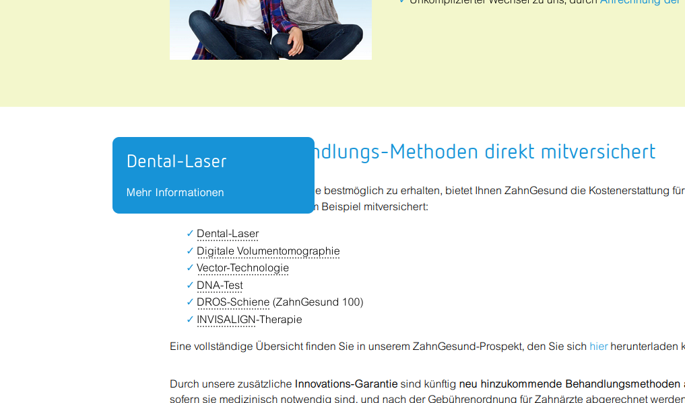
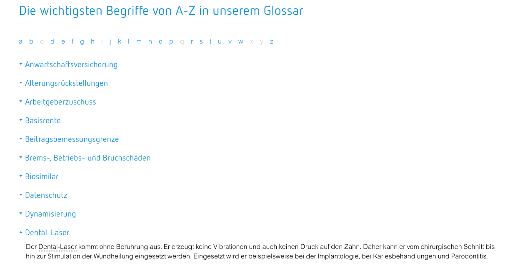

# in2glossar

This is s glossary extension for TYPO3

## Documentation

This is an extension especially build for the needs of one customer to show tooltips and a list view with all glossary
records.

## Changelog

| Version | Date       | State   | Description                                      |
|---------|------------|---------|--------------------------------------------------|
| 3.0.0   | 2024-07-16 | Feature | TYPO3 v11 compatibility and modern markup option |
| 2.0.2   | 2021-11-18 | Bugfix  | Sort by word in backend list module              |
| 2.0.1   | 2021-10-01 | Bugfix  | Fix exception in backend module                  |
| 2.0.0   | 2021-07-09 | Task    | Update for TYPO3 10                              |
| 1.1.0   | 2021-03-03 | Task    | Don't use tooltips in A-tags                     |
